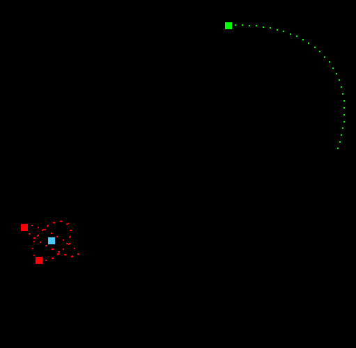
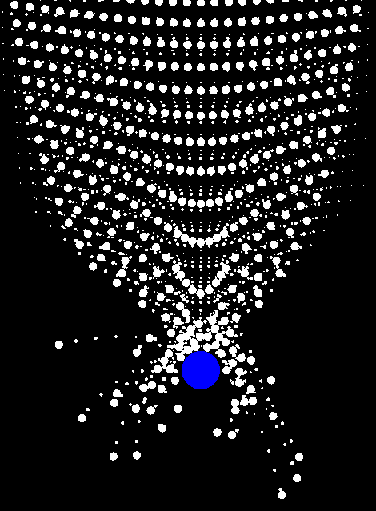

# Small scale physics engine
This project demonstrates a simple OpenGL application using GLFW3 and GLEW. It currently only displays N-body 2D physics.
<table>
  <tr>
    <td>
      
    </td>
    <td>
      
    </td>
  </tr>
</table>
## Dependencies

This project requires the following libraries:

- GLEW (OpenGL Extension Wrangler Library)
- GLFW3 (Graphics Library Framework)
- linmath.h (included in the project)

## Building the Project

### Prerequisites

Ensure you have the following installed on your system:

1. A C++ compiler (e.g., GCC, Clang)
2. GLEW library
3. GLFW3 library
4. CMake (optional, for easier build management)
